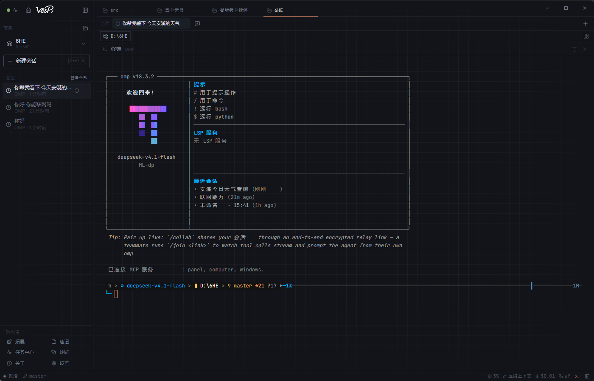
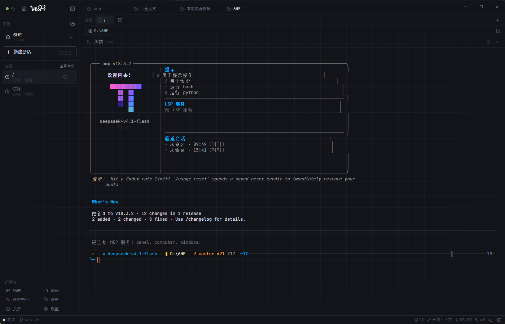
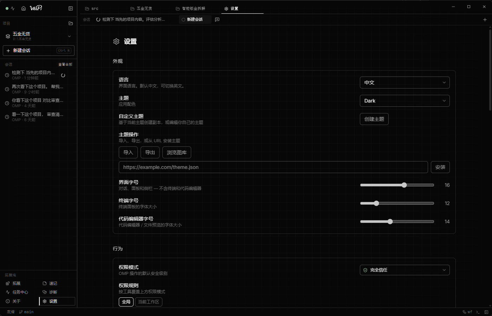

<p align="center">
  
</p>

<h1 align="center">VesPi</h1>

<p align="center">
  <b>Windows 上的 Oh My Pi（OMP）/ Pi 桌面客户端</b><br>
  一把会自我磨利的桌面智能快刀
</p>

<p align="center">
  <a href="#中文">中文</a> ·
  <a href="#english">English</a> ·
  <a href="https://github.com/esseener/VesPi/releases/latest">下载 1.0.15</a>
</p>

<p align="center">
  
  
  
  
</p>

搜索词 / Search: **VesPi** · **Pi** · **Pi Desktop** · **Oh My Pi** · **OMP** · **oh-my-pi** · **coding agent** · **桌面 Agent** · **AI 编程助手**

---

# 中文

VesPi 把 **[Oh My Pi（OMP）](https://github.com/can1357/oh-my-pi)** 和 **[Pi](https://pi.dev)** 收进一个 Windows 窗口：对话、工具卡片、审批、Diff、文件树、终端、模型和内核更新。

默认跑仓库/安装包里的私有 `omp.exe`（`--profile vespi --mode rpc-ui`）。不需要你自己配 PATH 上的 `omp` 或 `pi`。

当前版本 **[1.0.15](https://github.com/esseener/VesPi/releases/latest)**。

## 界面（本机 VesPi 1.0.1 实拍）

| 首页 | 对话 / Agent |
|---|---|
|  |  |

| 设置 |
|---|
|  |

截图来自当前 Windows 安装包，不是 Pi Desktop。界面默认中文，设置里可切 English。

## Agent 能做什么

VesPi **不另写一套 Agent 循环**。内核仍是 OMP / Pi：读改文件、跑命令、调工具、流式思考。壳负责监督。

- 流式回答、Thinking、工具卡片、权限审批
- 侧栏会话（按项目分组）、标签、归档、行内重命名
- 删除会话：**确认条贴在该会话上**，文件进 **Windows 回收站**（关于页可「打开回收站」）
- 输出过程中再打字：先选 **介入引导（steer）** 或 **排队等候（follow_up）**，都是 OMP 自带队列，**都不会掐断当前这句话**
- 每个活动会话一个内核进程，切走不会杀掉上一轮
- 任务中心、后台活动点、桌面通知
- Diff：显式 提交 → 推送 → PR
- 文件树、CodeMirror 编辑器、图片/HTML 预览、ANSI 终端
- 权限模式 + 规则；工作区信任门闩
- 插件 / 技能浏览、诊断、主题
- 双通道更新：界面看本仓库；**更新内核** 从 `can1357/oh-my-pi` 下载，带进度和成功/失败提示

## 1.0.15

质量门禁转绿：`npm run check`（类型检查 + lint + 985 项测试 + 发布一致性 + 构建）全量通过。页内查找的 Enter 跳下一个 / Esc 关闭快捷键修复（此前未挂到输入框）；清理 OpenSpace / Pi CLI 停用后的全部死代码；内核运行时改为 lockfile 锁定（版本 + SHA-256），发布构建严格校验。

## 1.0.14

全局审计修复：更新横幅可关闭；亮色主题流式状态跟随主题；界面文案全面 i18n；OpenSpace 停用（不再随会话启动、不再打包 Python）；内核更新加 SHA256 校验 + 健康检查 + 装坏自动回滚；启动时 models.yml 对账；用户气泡紧贴文字。

## 1.0.13

修复「保存的模型不出现在选择器」：OMP 只认 `models.yml`，此前 VesPi 只写 `models.json`，profile 里的旧 yml 把新供应商全部挡住了。保存时会同时写 models.yml，重启内核后新模型立即出现。

## 1.0.12

测试拉取模型后不再自动收起供应商；保存成功后若无会话在跑会自动重启内核，新供应商/新模型立刻出现在模型选择器里。

## 1.0.11

修复：添加自定义供应商时，名称框敲第一个字母折叠就自动合上、无法继续填写。折叠状态改用稳定行 id，编辑中途不再收起。

## 1.0.10

下线免安装便携版：自解压包每次启动都要解压约 400 MB（Electron + OMP 内核 + OpenSpace 运行时），双击后长时间无响应。只保留安装版。

## 1.0.9

发出第一条消息的瞬间，侧栏就出现这条会话；会话标题自动取首条消息（≤40 字，Codex/ZCode 风格，不额外调用模型）。手动重命名始终优先。

## 1.0.8

新建会话不再闪「正在启动 OMP…」：启动期间空会话界面保持不变，输入框可直接打字，发送会等内核就绪后自动发出。

## 1.0.7

空会话输入框下的项目选择器跟随当前工作区（此前停留在启动时的 No project）。打包前自动拉取最新 OMP 内核。

## 1.0.6

顶栏项目标签的移除确认贴在标签下方（此前被标签条裁剪，点 × 没反应）。

## 1.0.5

首页和关于页的「下载」会直接拉取 Windows 安装包并打开安装程序，不再只打开 GitHub 仓库。

## 1.0.3

设置里的主题/语言等下拉改为跟随 Dark 主题，不再弹出系统白底菜单。

## 1.0.2

首页顶栏「下载 / 更新内核」在启动页也能点，不再被窗口拖拽层挡住。1.0.0 / 1.0.1 打开应用会提示有更新。

## 1.0.1 这一版

- 会话删除贴行确认 + 回收站
- 顶栏标签：点设置/关于/速记/拓展，显示对应名字
- 内核更新：检查 → 下载百分比 → 替换 → 重启会话 → 绿/红结果
- 输出中补充：介入引导 = 等工具跑完、下次叫模型前插入（和 OMP 终端打字一样）；排队等候 = 整轮空闲后再发

## 下载（Windows x64）

[Releases](https://github.com/esseener/VesPi/releases/latest)

- 安装包：`VesPi-Setup-1.0.15-win-x64.exe`（推荐，装到 `%LOCALAPPDATA%\Programs\VesPi\`）

未签名时 SmartScreen 选「更多信息 → 仍要运行」。

## 内核：Oh My Pi 与 Pi

| | OMP（默认） | Pi |
|---|---|---|
| 程序 | 安装包内 `omp.exe` | 可选外部 `pi` |
| 参数 | `--profile vespi --mode rpc-ui` | 标准 Pi RPC |
| 会话 | `~/.omp/profiles/vespi/agent/sessions` | `~/.pi/agent/sessions` |

打开某条会话时，启动的是**写下这条会话的引擎**。

## 开发

```bash
cd desktop
npm install
npm run dev
npm run package:win:nsis
```

公开仓库：[esseener/VesPi](https://github.com/esseener/VesPi)。不要把产品更新推到 `FaqFirebase/pi-desktop`。

---

# English

**VesPi** is the Windows desktop GUI for **[Oh My Pi (OMP)](https://github.com/can1357/oh-my-pi)** and the **[Pi](https://pi.dev)** coding agent: chat, tool cards, approvals, Diff, file tree, terminal, models, and kernel updates in one window.

Shipped builds run a private `omp.exe` (`--profile vespi --mode rpc-ui`). You do not need a global `omp` / `pi` on PATH.

Current release: **[1.0.15](https://github.com/esseener/VesPi/releases/latest)**.

Based on [Pi Desktop](https://github.com/FaqFirebase/pi-desktop) (Apache-2.0). VesPi is the shell; OMP/Pi stay the agent.

## Agent surface

Streaming replies, thinking, tool cards, per-session processes, Mission Control, Diff Commit → Push → PR, editor, terminal, permission rules, package/skill browser, dual updates (UI from this repo, kernel from `can1357/oh-my-pi` with a progress bar).

While the model is writing, extra text is not sent immediately. **Steer** and **follow_up** are native OMP queues and **do not abort** the current reply. Steer injects after current tools, before the next model call (same idea as typing in the OMP TUI). Follow-up waits until the agent is idle.

## Download

- Installer: `VesPi-Setup-1.0.15-win-x64.exe`

## License

VesPi changes: Apache-2.0. Keep Pi Desktop NOTICE. OMP remains upstream MIT.
