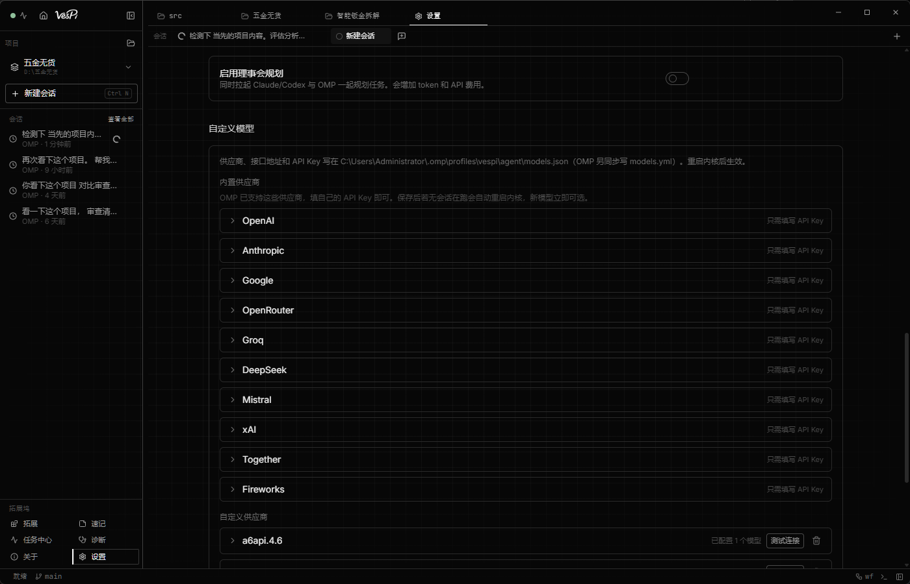

<p align="center">
  <picture>
    <source media="(prefers-color-scheme: dark)" srcset="docs/brand/vespi-wordmark-white.png">
    
  </picture>
</p>

<h1 align="center">VesPi</h1>

<p align="center">
  <b>Windows 上的 OMP 桌面客户端</b><br>
  把 Oh My Pi 的完整执行能力，收进一个可监督的窗口
</p>

<p align="center">
  <a href="https://github.com/esseener/VesPi/releases/latest"></a>
  <a href="https://github.com/esseener/VesPi/releases"></a>
  
  
  <a href="LICENSE"></a>
</p>

<p align="center">
  <a href="https://esseener.github.io/VesPi/">官网</a> ·
  <a href="#下载与安装">下载</a> ·
  <a href="#功能">功能</a> ·
  <a href="#常见问题">常见问题</a> ·
  <a href="#从源码构建">从源码构建</a> ·
  <a href="CONTRIBUTING.md">参与贡献</a>
</p>

---

## 简介

VesPi 是 Windows 上的 **[Oh My Pi（OMP）](https://github.com/can1357/oh-my-pi)** 桌面客户端。
会话、Diff、终端、权限、模型与设置集中在同一个窗口，**内核随安装包一并交付** —— 安装后选择
工作区、配置模型，即可开始工作。

它**不是**网页套壳，不是终端界面的像素复制，也不自带第二套 Agent 实现：Agent 循环、工具、
子代理与会话始终由 OMP 负责，VesPi 负责界面、权限审批与进程治理。

| | |
|---|---|
| 内核 | 私有 `omp.exe`，以 `--profile vespi --mode rpc-ui` 启动，版本随应用锁定 |
| 运行时依赖 | **无**。不需要 Node、Bun，也不需要 PATH 上有 `omp` |
| 会话位置 | `~/.omp/profiles/VesPi/agent/sessions` |
| 数据 | 会话、用量统计与配置保存在本机，不上传 |

## 界面

<p align="center">
  
</p>

<p align="center">
  
  
</p>

## 功能

**Agent 执行**

- 流式回答，思考过程默认折叠，需要时点开查看
- 工具调用逐条成卡，显示执行状态、耗时与输出，连续调用自动归组
- 目标模式：跨多轮的任务交给一个持续目标，进度与 Token 消耗实时可见
- 子代理并行执行，进度汇总在输入框上方

**会话与并行**

- 每个会话独占一个内核进程，切换到其他项目不会中断当前任务
- Mission Control 总览所有工作区正在运行的会话
- 新任务可投递到后台会话，需要隔离时为它单独开一个 Git Worktree
- 分叉、克隆、重命名、标签、搜索与归档

**审查与权限**

- 文件写入与命令执行可逐次审批，也可按工具、按目录设置放行规则
- Diff 在对话内呈现，逐文件查看
- Review 栏汇总改动文件、权限请求与会话状态
- 未标记信任的仓库只能收紧权限，不能放宽

**开发工具**

- 文件树与文件搜索；代码、图片、PDF、HTML 内嵌预览
- CodeMirror 6 编辑器，多语言语法高亮
- 集成终端（完整 PTY，支持 ANSI 颜色）
- 内嵌浏览器面板，Agent 可直接操作页面，过程同步可见

**模型与维护**

- 多供应商接入，随时切换模型与思考等级
- 技能与工具扩展管理，支持接入 MCP 服务
- 用量看板：消息数、Token、活跃天数与模型占比，实时更新
- 应用内更新：界面与内核分别升级，覆盖安装保留会话与配置

## 下载与安装

前往 **[Releases](https://github.com/esseener/VesPi/releases/latest)** 下载最新安装包：

```
VesPi-Setup-<version>-win-x64.exe
```

按提示完成安装，启动后在首页选择工作区、配置模型供应商，然后输入任务。

> **关于安全提示**：当前构建未做代码签名，首次运行 Windows SmartScreen 会给出提示，
> 选择「更多信息」→「仍要运行」即可。安装包附有 `SHA256SUMS.txt`，可校验完整性；
> 也可以直接从源码构建。

## 系统要求

| | |
|---|---|
| 操作系统 | Windows 10 / 11（x64） |
| 磁盘空间 | 约 500 MB |
| 运行时 | 无需预装任何运行时或全局命令行工具 |
| 网络 | 首次使用需配置模型供应商；更新从 GitHub 获取 |

## 常见问题

**需要先安装 Node、Bun 或 OMP 吗？**
不需要。内核随安装包交付，不写入 PATH，也不读取全局安装的 `omp`。

**内核可以自行替换吗？**
内核版本随应用锁定，避免与界面版本错配；升级通过应用内更新完成，无需手动替换文件。

**会自动修改我的项目或系统环境吗？**
不会。所有文件写入与命令执行都在权限审批之下，可按工具与目录配置规则。

**数据存放在哪里？**
会话、用量统计与配置都在本机用户目录，不会上传。删除会话后历史统计仍会保留。

**怎么更新？会丢配置吗？**
应用内检查并下载更新，界面与内核分别升级；覆盖安装会保留会话记录与配置。

**有 Windows 以外的版本吗？**
当前正式支持 Windows x64。其他平台需要对应的内核构建后再行支持。

## 从源码构建

需要 Node.js 22 或更高版本。

```bash
git clone https://github.com/esseener/VesPi.git
cd VesPi
npm install
npm run dev                # 开发模式
npm run check              # 类型检查 + lint + 测试 + 发布一致性 + 构建
npm run package:win:nsis   # 生成 Windows 安装包
```

内核不在版本库中：构建与打包脚本会按 `resources/omp-runtime-lock.json` 声明的版本与
SHA-256 准备并校验内核，产物输出到 `release/`。

## 参与贡献

欢迎提交 Issue 与 Pull Request。请先阅读 [CONTRIBUTING.md](CONTRIBUTING.md)（含
[CLA](CLA.md) 说明）；安全相关问题的反馈方式见 [.github/SUPPORT.md](.github/SUPPORT.md)。

## 许可证

Apache-2.0，见 [LICENSE](LICENSE)。本项目包含源自上游 Apache-2.0 项目的桌面界面代码，
其版权与许可声明见 [NOTICE](NOTICE)；Agent 执行由 [oh-my-pi](https://github.com/can1357/oh-my-pi) 提供。

---

<details>
<summary><b>English</b></summary>

<br>

**VesPi** is the Windows desktop client for the **[Oh My Pi (OMP)](https://github.com/can1357/oh-my-pi)**
coding agent. Chat, Diff, terminal, permissions, models and settings live in one window, and the
kernel ships inside the installer — no Node, no Bun, no global `omp` on PATH.

VesPi is not a web wrapper, not a pixel copy of the terminal UI, and not a second agent harness:
the agent loop, tools, subagents and sessions stay with OMP. VesPi provides the interface, the
permission gate and process management.

- **Agent** — streaming replies with collapsible thinking, per-call tool cards, goal mode with live
  progress, parallel subagents
- **Sessions** — one kernel process per session, Mission Control across workspaces, background
  sessions with optional Git worktrees, fork / clone / tag / search / archive
- **Review** — per-call approval with per-tool and per-directory rules, in-chat diffs, review rail,
  workspace trust that can only tighten
- **Tools** — file tree and search, inline previews (code, image, PDF, HTML), CodeMirror 6 editor,
  a full PTY terminal, and an embedded browser the agent can drive
- **Models** — multiple providers, switchable models and thinking levels, skills, MCP servers
- **Maintenance** — live usage dashboard, in-app updates for both the shell and the kernel

Download the latest `VesPi-Setup-<version>-win-x64.exe` from
[Releases](https://github.com/esseener/VesPi/releases/latest). The current build is unsigned;
Windows SmartScreen will prompt once — see the note above.

Build from source with Node.js 22+:

```bash
npm install && npm run dev
```

Licensed under Apache-2.0. See [NOTICE](NOTICE) for the upstream attribution of the desktop
UI code.

</details>
