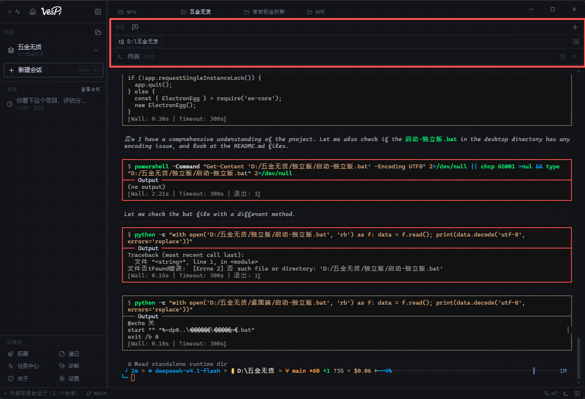
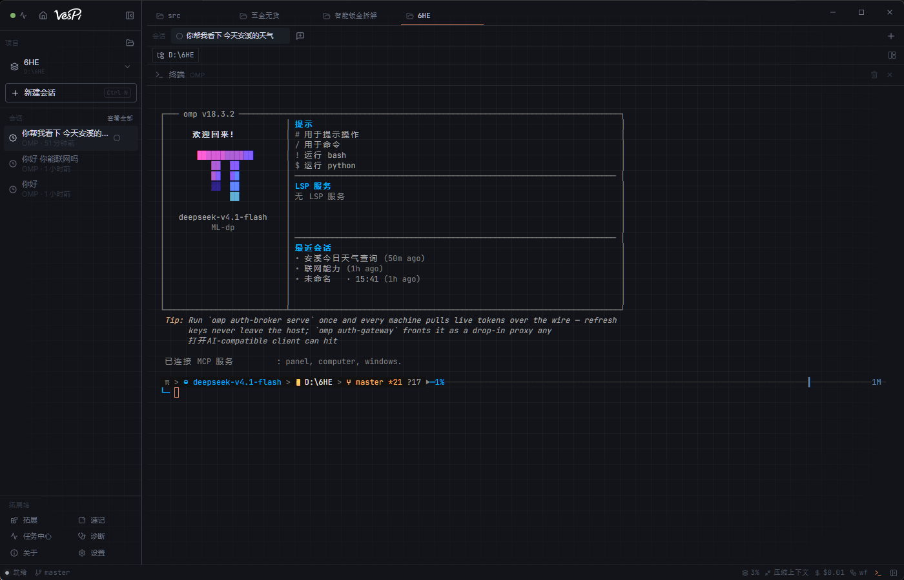

<p align="center">
  <picture>
    <source media="(prefers-color-scheme: dark)" srcset="docs/brand/vespi-wordmark-white.png">
    
  </picture>
</p>

<p align="center">
  <b>Windows 上的 OMP 桌面外壳</b><br>
  终端优先 · 多工作区 · 中文 TUI · 设置直达 OMP 配置
</p>

<p align="center">
  <a href="https://github.com/esseener/VesPi/releases/latest"></a>
  <a href="https://github.com/esseener/VesPi/releases"></a>
  
  
  <a href="LICENSE"></a>
</p>

<p align="center">
  <a href="https://esseener.github.io/VesPi/">官网</a> ·
  <a href="#下载与安装">下载</a> ·
  <a href="#产品形态">产品形态</a> ·
  <a href="#功能">功能</a> ·
  <a href="#常见问题">常见问题</a> ·
  <a href="#从源码构建">从源码构建</a>
</p>

---

## 简介

**VesPi** 是 **[Oh My Pi（OMP）](https://github.com/can1357/oh-my-pi)** 的 Windows 桌面外壳。

这一代产品**彻底改版**：界面从「聊天面板 + 侧栏」收敛为 **设置 + 工作区分类 + 终端**。
真正的 Agent 交互发生在终端里的 **OMP TUI**；GUI 不再扮演第二套聊天界面，只负责
窗口管理、工作区切换、配置写入与中文显示层。

| | |
|---|---|
| 主交互面 | 终端内嵌 `omp --profile vespi` TUI（完整能力） |
| GUI 职责 | 工作区标签、会话索引、设置（写入 OMP profile）、主题与字号 |
| 内核 | 随安装包交付的 `omp.exe`（当前 **18.3.2**），不读全局 PATH |
| 运行时依赖 | **无**。不需要 Node、Bun |
| 会话位置 | `~/.omp/profiles/vespi/agent/sessions` |
| 配置位置 | `~/.omp/profiles/vespi/agent/config.yml`（GUI 与 TUI 共用） |

**OMP 是能力真源。** 工具、子代理、会话、斜杠命令全部由 TUI 提供；VesPi 的按钮
尽量驱动同一套 OMP 语义（`/new`、`/resume`、`/rename`、`config.yml`）。

## 产品形态

```text
┌─────────────────────────────────────────────┐
│  工作区标签   src │ 项目A │ 项目B │  +      │
├──────────┬──────────────────────────────────┤
│ 会话列表  │                                  │
│ 项目树    │        OMP TUI（终端）           │
│ 设置/诊断 │   欢迎页 · 对话 · 工具 · 框线    │
│          │                                  │
│          │   π > ● model ▸ path ▸ git       │
└──────────┴──────────────────────────────────┘
```

- **顶栏** = 多工作区切换（每个工作区独立 cwd / 会话索引）
- **中央** = 终端，直接跑 OMP TUI，不是伪终端聊天
- **侧栏** = 会话、文件、设置、诊断等入口
- **设置** = 写入 OMP profile（主题、符号、思考等级、模型）

## 界面

<p align="center">
  
</p>

<p align="center">
  
  
</p>

## 功能

**终端优先**

- 完整 PTY 内嵌 OMP TUI，ANSI 真彩色、框线、滚动齐全
- 中文显示层：TUI 英文界面覆盖为中文（等宽替换，不撑歪框线）
- 圆角框规范为直角，灰字对比度提升，字号/行高按 DPI 校准
- 内核更新后自动重启终端并刷新译包

**工作区与会话**

- 多工作区标签，切换即换 cwd 并重启 TUI
- 侧栏会话列表与 OMP 会话存储同步
- 「新建会话」→ 终端 `/new`；打开会话 → `/resume`；重命名 → `session_info` + `/rename`
- 删除当前会话后 TUI 自动开新会话

**设置 = OMP 配置**

| GUI | 写入 |
|-----|------|
| OMP 主题 | `theme.dark`（anthracite / titanium / …） |
| 符号集 | `symbolPreset` |
| 默认思考等级 | `thinking.defaultLevel` |
| 选择模型 | `modelRoles.default` + TUI `/model` |
| 思考等级 | `thinking.defaultLevel` + TUI `/thinking` |

配置为**合并写入**，不覆盖无关字段。GUI 自己的字号、语言、主题仍属 VesPi 外壳。

**外观**

- Anthracite 深色为主，墨色底 + 橙强调色
- 终端透明底，透出窗口网格；自定义滚动条
- 灰色/半亮文字对比度强制达标（可读）

**维护**

- 界面与内核双通道更新（GitHub Releases）
- 内核锁定 `resources/omp-runtime-lock.json`，打包前校验
- 会话、配置、用量统计仅存本机

## 中文层说明

OMP TUI 由内核绘制，GUI **不能改它的排版**，只能在输出流上做覆盖翻译：

- 等宽替换（中文双宽补空格），保证框线列对齐
- 词边界匹配，避免 `Updated` → `更新d`
- 轮换 Tip 按片段汉化
- 动态内容（模型名、路径、版本号）保留原文

要做到整屏无英文，需 OMP 内核自带 i18n。当前中文层是**实用近似**，不是官方本地化。

## 下载与安装

前往 **[Releases](https://github.com/esseener/VesPi/releases/latest)** 下载：

```
VesPi-Setup-<version>-win-x64.exe
```

安装后启动：选工作区 → 配置模型 → 在终端里和 OMP 对话。

> **安全提示**：当前构建未做代码签名。SmartScreen 选「更多信息」→「仍要运行」。
> 安装包附 `SHA256SUMS.txt`，可校验完整性。

## 系统要求

| | |
|---|---|
| 操作系统 | Windows 10 / 11（x64） |
| 磁盘空间 | 约 600 MB |
| 运行时 | 无需预装 |
| 显示 | 建议 100% 缩放以获得最直的 TUI 框线 |

## 常见问题

**为什么主界面是终端，不是聊天窗？**  
OMP 的完整能力在 TUI 里（工具、子代理、斜杠命令、权限）。GUI 只做窗口与配置，避免两套逻辑打架。

**GUI 按钮会驱动 OMP 吗？**  
会话新建/打开/重命名/删除、模型与思考、OMP 主题会写入 profile 或注入 TUI 命令。
Git 传送带是本地 `git`（界面已标注「不经 agent」）。

**需要预装 OMP / Node 吗？**  
不需要。内核随安装包交付，不写 PATH。

**数据在哪？**  
`~/.omp/profiles/vespi/`，全部本机。

**终端框线不直？**  
请将 Windows 显示缩放设为 100%。字号与行高已按整像素校准。

## 从源码构建

需要 Node.js 22+。

```bash
git clone https://github.com/esseener/VesPi.git
cd VesPi
npm install
npm run dev
npm run check              # typecheck + lint + test + 发布一致性 + build
npm run package:win:nsis   # Windows 安装包
```

内核不在仓库中：按 `resources/omp-runtime-lock.json` 下载并校验。

## 参与贡献

Issue / PR 欢迎。见 [CONTRIBUTING.md](CONTRIBUTING.md)；安全问题见 [.github/SUPPORT.md](.github/SUPPORT.md)。

## 许可证

Apache-2.0，见 [LICENSE](LICENSE)。桌面界面部分源自上游 Apache-2.0 项目，见 [NOTICE](NOTICE)。
Agent 执行由 [oh-my-pi](https://github.com/can1357/oh-my-pi) 提供。捆绑 [Laya](https://github.com/NandhaKishorM/laya)（Apache-2.0）用于译名决策。

---

<details>
<summary><b>English</b></summary>

<br>

**VesPi** is the Windows desktop shell for the **[Oh My Pi (OMP)](https://github.com/can1357/oh-my-pi)**
agent kernel. This generation is a **full redesign**: the UI is now **settings + workspaces + terminal**.
The real agent surface is the **OMP TUI inside the terminal**; the GUI manages windows, workspaces,
and writes OMP profile config.

- **Terminal-first** — full PTY hosting `omp --profile vespi`, Chinese display overlay, square boxes
- **Workspaces** — tab strip, per-workspace cwd and session index
- **Settings → OMP** — `theme.dark`, `symbolPreset`, `thinking.defaultLevel`, `modelRoles.default`
- **Sessions** — `/new`, `/resume`, `/rename` drive the OMP session store
- **Kernel** — ships in the installer (18.3.2), never a global `omp`

Download `VesPi-Setup-<version>-win-x64.exe` from
[Releases](https://github.com/esseener/VesPi/releases/latest). Apache-2.0.

</details>
