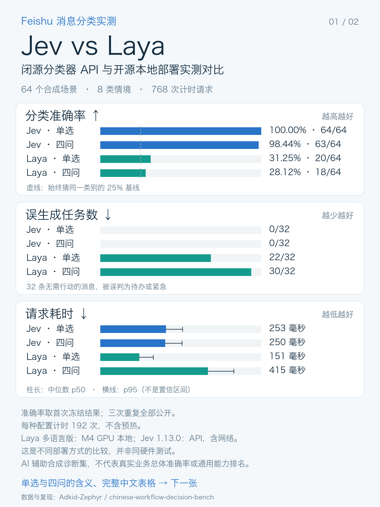
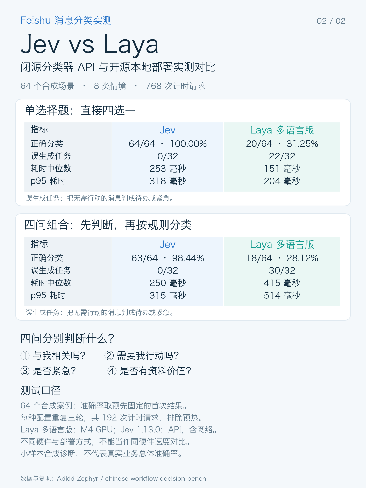

# Feishu 风格中文消息分类评测

[English](README.md) · [完整原项目](https://github.com/Adkid-Zephyr/chinese-workflow-decision-bench)

按 [issue #154](https://github.com/NandhaKishorM/laya/issues/154) 的讨论，提供一套可直接核验和复测的小型诊断：**64 个中文合成场景、8 类情境、4 个均衡标签**。

**输入是 AI 辅助编写的合成场景，不是真实飞书聊天提取；输出与耗时是模型实际调用记录。** 不含中文后训练权重，不宣称通用模型排名或真实业务准确率。



## 先核验，零下载、零费用

从 Laya 仓库根目录执行：

```bash
python research/benchmarks/feishu_zh/audit.py
python -m unittest discover -s research/benchmarks/feishu_zh/tests -v
```

只需 Python 3.10+，不依赖模型、API Key 或第三方库。检查冻结哈希、样本与请求配对、原始响应解码、完整分母、概率有效性，并重新计分。

| 首次固定结果 | Laya 多语言版 | Jev 1.13.0 |
|---|---:|---:|
| 单选择题 | 20/64 | 64/64 |
| 四问组合 | 18/64 | 63/64 |

这是 **2026-09-21 的历史快照，不是当前 main 分支的成绩**。三次重复全部保留，不挑最好一次；Jev 单选另一次为63/64。Laya用本机M4 MPS，Jev耗时含网络，两者不是同硬件测试。完整版本、配置、局限在英文说明及metadata中。

## 自己跑一遍

按英文说明下载/准备本地多语言checkpoint，然后先试两题：

```bash
PYTHONPATH=. python research/benchmarks/feishu_zh/run.py --backend laya \
  --checkpoint "$CHECKPOINT" --device cpu --limit 2 --repeats 1 --modes choice \
  --output /tmp/feishu-laya-smoke
python research/benchmarks/feishu_zh/audit.py --run-dir /tmp/feishu-laya-smoke
```

完整评测省略limit/repeats/modes参数。可将device改为mps或cuda；每次使用新输出目录。脚本不自动下载模型，记录实际代码/权重哈希，不沿用历史版本信息。Jev比较是可选且收费的，详见[英文入口](README.md#optional-jev-comparison)。

## 这套测试的几个小设计

- 指定目标消息与chat_id，检验是否受其他群或引用内容干扰。
- 单独报告“把别人的事变成我的待办”与“漏掉我的任务”，不只看准确率。
- 固定两个工作流：直接四选一；四个独立判断后按固定规则分类。
- 参考标签、场景类别和解释不传给模型；失败请求也留在分母中。
- 场景、标签规则、逐条模型输出都保留，方便发现标注歧义或提出修正。



这可以作为中文用户的评测入口，而不是新增产品界面。无需把当前低分解释为“不支持中文”：被测的是多语言基础版；提示、任务迁移与校准都有影响。后训练实验另行处理，不能用这些公开题训练后再称独立测试提升。

贡献署名、MIT许可与来源版本见[英文说明](README.md#limitations-and-attribution)。所有图表都从保存的分数生成。
